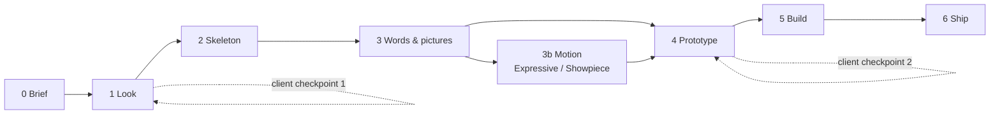

# Website Build Framework v2

v2.1 · 2026-09-19 · exported from the Claude doc "Website Build Framework v2"

## What changed vs the plugin

The old playbook asked you to run a design studio; this version asks you to be a client with taste. Eleven phases, three switches, six planning documents, parallel tracks and gates made every step feel important and none feel understandable. The hardest part was that the plugin generated options and then handed you the verdict with no way to reach it.

Three ideas replace that:

1. **Claude Design is the studio.** Directions, layouts and full-fidelity pages are rendered there and iterated with comments, edits and sliders. The old spike harness, contact sheets and subagent mockups go away because the tool now does that job natively.
2. **Every phase produces exactly one thing.** A page of brief, a locked look, a skeleton, a content file, a prototype, a build, a live site. If you cannot point at the one thing, the phase is not done.
3. **You are the judge, not the designer, and judging has a recipe.** Every time you are asked to pick, you run the same three or four checks (section "How to be the judge"). Claude owns everything you should never have to evaluate: spacing, type scales, accessibility, code, SEO, performance.

Kept from the old plugin: the interview that gets to a shared conclusion, the "never decide from a description, only from a render" rule, the never-invent list for copy, and the Astro + Cloudflare Pages stack.

## The shape

Seven phases in order, one output each, plus a Motion phase (3b) that only runs when the brief asks for it. A brochure site should take about one working day of your time spread over a week of client replies; an Expressive or Showpiece site adds half a day to a day of yours, mostly looking at spikes on your phone. Claude works far longer than that, you do not.

| # | Phase | Goal in one line | Where it happens | Who drives | The one output | Your time |
| --- | --- | --- | --- | --- | --- | --- |
| 0 | Brief | Know who the site is for, the one thing it must make a visitor do, and the motion tier | Claude (chat or Code) | Claude interviews, you answer | `BRIEF.md`, one page | 45 min |
| 1 | Look | Lock a brand direction: palette, type, imagery mood | Claude Design | Claude proposes 3, you pick 1 | A saved design system + `LOOK.md` | 1 h |
| 2 | Skeleton | Agree the pages and the sections on each, as grey boxes | Claude Design (low-fi) | Claude proposes, you walk the visitor path | `SITEMAP.md` | 45 min |
| 3 | Words and pictures | Every section has real, true copy and a real image assigned | Claude Code | Claude drafts, you fact-check | `CONTENT.md` + `assets/` | 1.5 h |
| 3b | Motion (Expressive and Showpiece only) | Pick the motion concept and prove it works in a throwaway spike | Claude Code, spikes in the repo | Claude proposes 2 to 3 concepts with references, you pick and test | `MOTION.md` + the winning spike | 1 to 3 h |
| 4 | Prototype | Full-fidelity pages the client can click through | Claude Design | Claude builds, you review in three passes | Shareable prototype link | 2 h |
| 5 | Build | The prototype as a real Astro site, pixel-close | Claude Code (handoff) | Claude builds, you compare side by side | Running site on a preview URL | 1 h |
| 6 | Ship | Live, fast, accessible, animated per `MOTION.md`, signed off | Claude Code | Claude runs checklists, you test on your phone | Live URL + `HANDOVER.md` | 1 h |

The client sees two things: the chosen look with one runner-up after phase 1, and the prototype link after phase 4. Everything else you decide as their proxy. Going back one phase is normal; going back two is a sign the brief was wrong, so fix the brief first.

## How to be the judge

You never judge design quality; you judge fit. Claude makes sure every option is competent. Your only question is which option is right for this client, and the checks below turn that from a feeling into a procedure. Run them in order and stop at the first one that separates the options.

1. **Three-adjective test.** The brief names three adjectives for the brand (phase 0). Look at each option and say out loud which adjectives it matches. An option that misses one is out, however pretty.
2. **Five-second test.** Look at the option for five seconds, look away, and say what the business does and what you would click. If you cannot, the option failed, whatever else it does well.
3. **Squint test.** Squint until the text blurs. What still stands out is what the layout is actually saying. It should be the headline and the one action, not a decorative shape.
4. **Competitor test.** Would the client's closest competitor be happy to use this exactly as is? If yes, it is generic; ask for the option to be pushed further before you compare again.
5. **Phone-in-hand test.** Open it on your own phone, not a resized browser window. If your thumb cannot reach the main action or you scroll past the point without noticing it, that is a failure of the option, not of you.

Rules that stop you spiralling:

- Compare renders, never descriptions, and always with the same real content in every option. Three options at most; a fourth means the brief is vague.
- Pick one and improve it. Never ask for a merge of two options; that is how every site ends up looking the same.
- Name the one thing that bothers you most, not a list of twelve. Claude fixes it, you look again. Three such rounds is the budget for any single decision.
- Torn between two after all five checks: choose the one closer to the client's adjectives; if still torn, the bolder one for a brand or studio site, the calmer one for a product or professional site. Then move on within ten minutes.
- Say what you feel, not what to change. "The hero feels cold" is a perfect comment; "make the blue warmer" is you doing Claude's job and usually the wrong fix.

You never have to evaluate: spacing and alignment, type scale, color contrast ratios, responsive breakpoints, code quality, SEO basics, page speed, accessibility. Claude checks those with tools and reports; if something there looks off to you, say so, but you are not the gate.

## Phase 0. Brief

**Goal:** one page that says who the site is for, the one thing it must make them do, and what the brand should feel like. Everything later is checked against this page, so it is the only phase where you do most of the talking.

**How it runs.** Claude interviews you in five short rounds and writes `BRIEF.md` as you go, reading each section back so you can correct it. This is the part of the old plugin you liked, kept and shortened. Bring whatever the client gave you (logo, photos, old site, notes) and point Claude at it before the interview; it should confirm, not ask, anything it can read.

1. *The business.* What they do, for whom, where, and what they are better at than the shop down the street. One paragraph in plain words.
2. *The one job.* The single action a visitor should take (call, book, request a quote, visit). If the client wants three, you rank them and the site gets one primary.
3. *The feel.* Three adjectives the brand should be and two it must never be, plus two or three sites the client admires (and what specifically in them) and one they dislike. Vague words like "modern" and "clean" get pushed back once: "show me a site that is modern in the way you mean."
4. *The motion tier.* Quiet, Expressive or Showpiece. **Quiet** is reveals and hover states only; the site is still and confident. **Expressive** is scroll-driven storytelling on one or two sections plus cursor-reactive details, motion that visibly belongs to the brand. **Showpiece** means the site is partly a demonstration: a 3D model, a scroll-constructed hero, a scrubbed image sequence, things that need produced assets and real engineering time. Claude proposes the tier from three facts you already gave it: whether the client has something worth showing (a studio or a product earns more than a service with nothing to look at), what materials exist or can be made, and how much time the project can carry. Quiet is the default and needs no justification; Expressive and Showpiece get one sentence in `DECISIONS.md` saying why.
5. *The facts.* Pages they need, languages, materials in hand and materials missing, deadline, domain and hosting, legal footer needs, anything explicitly out of scope.

**Output:** `BRIEF.md`, under one page, with those five headings and a materials list marked "have" or "missing, from whom, by when". Also a `DECISIONS.md` file is created with one line: the date and "brief agreed". Every later pick gets one line here with a one-sentence why; this log is what you show the client when they ask "why blue?".

**Your job:** answer honestly, push back on your own vague answers, and supply the adjectives yourself if the client cannot.

**How to check it is done:**

- [ ] Read the brief aloud; it takes under two minutes and the client would nod at every sentence.
- [ ] The one job is a verb a visitor performs, not a goal of the business ("request a quote", not "increase sales").
- [ ] The three adjectives could not describe every business in the same street; if they could, sharpen them.
- [ ] The motion tier is named, and if it is Showpiece the brief says what asset makes the show (a model, a render sequence, a product shoot) and who produces it by when, because that work starts right after phase 1, not after the copy.
- [ ] Nothing says "TBD" except items waiting on the client, each with a name and a date next to it.

## Phase 1. Look

**Goal:** lock the brand direction: palette, type pairing, imagery treatment and overall mood, so that no later phase argues about colour. Nothing about page structure is decided here.

**How it runs.** Open a new Claude Design project, paste `BRIEF.md`, upload the logo and any real photos, and ask for three distinct directions. Each direction is one board: a palette with roles (background, text, accent, one surface), a headline and body typeface, an imagery treatment (photo style, illustration, or none), and one mocked hero using the client's real headline and a real photo. The three must be different ways of being the three adjectives, not three shades of one idea; ask Claude Design to name each direction in two words so you can talk about them.

You pick one using the judge checks. Then one round of pushing the winner: ask for the same board with the accent bolder, or the type more characterful, and choose between winner and pushed winner. Once chosen, ask Claude Design to save it as the project's design system so every later screen inherits it, and ask it to write `LOOK.md`: hex values with roles, font names and where they are used, the imagery rule, three do's and three don'ts. The two losing directions are listed at the bottom as "rejected because", which stops them coming back.

**Client checkpoint 1.** Share the winner and the runner-up, not all three. Ask one question: "which of these feels more like you?" If they pick the runner-up, that is fine; you did not lose work. If they want a mix, use the judge rule: pick one, then improve, no merging.

**Output:** a saved design system in Claude Design and `LOOK.md` in the repo, plus one line in `DECISIONS.md`.

**Your job:** the gut. You are the only person in the loop who has met the client.

**How to check it is done:**

- [ ] Three-adjective test on the winner passes for all three, and the two "never" adjectives do not apply.
- [ ] Competitor test: the client's closest competitor would not simply steal this. If they would, push once more.
- [ ] The hero mock uses the client's real headline and real photo, not placeholders; a direction that only works with stock photography is not a direction.
- [ ] Squint test on the hero: the headline and the one action stand out, not the decoration.
- [ ] `LOOK.md` fits on one screen and a stranger could recreate the mood from it.

## Phase 2. Skeleton

**Goal:** agree which pages exist and what sections each one has, in what order, before a single sentence of copy is written. This is the phase you said you wanted ("just the structure"), and keeping it low-fidelity is what makes it fast.

**How it runs.** In the same Claude Design project, ask for a sitemap and grey-box wireframes: every page as a vertical stack of labelled boxes ("hero: headline + one button", "three services", "proof: two testimonials", "contact form"), no colour, no real type, no images. Claude proposes the whole structure in one go from the brief, and for the homepage only it offers two alternatives that differ in one thing, such as services-first versus story-first. You pick and Claude writes `SITEMAP.md`: the navigation in order, each page with its purpose in one sentence, its section list, and the one action the page pushes toward.

The default for a brochure site is five to seven pages and a navigation of at most five items plus one button. Any page that cannot name its purpose in one sentence is folded into another. Any section for which the client has no content and no plan to get it is cut now, not in phase 3.

**Output:** `SITEMAP.md` and the grey-box boards in Claude Design.

**Your job:** walk the visitor path. You are not judging looks here; there are none.

**How to check it is done:**

- [ ] Pretend to be the brief's visitor arriving from Google with one question. Say the question aloud, land on the homepage board, and point to the box that answers it and the box you would click next. Do this for the three most likely questions. Each takes under ten seconds or the structure is wrong.
- [ ] Every page ends in the one action from the brief, or hands off to a page that does.
- [ ] Navigation has five items or fewer plus one button, and the labels are words the client's customers use, not the client's internal names.
- [ ] Every section box names content that exists or is on the "missing, from whom, by when" list. No box says "something about the team".
- [ ] Nothing in `SITEMAP.md` talks about colour, type or images. If it does, move that sentence to `LOOK.md`.

## Phase 3. Words and pictures

**Goal:** every box in the skeleton has final, true copy and a real image assigned before the prototype is built. Prototypes built on lorem ipsum look great and then fall apart when the real words arrive, so this phase sits before phase 4 on purpose.

**How it runs.** This is a Claude Code phase in the project repo. Claude reads `BRIEF.md`, `SITEMAP.md` and the client's raw material (notes, old site, brochures, voice memos transcribed) and drafts `CONTENT.md`: one section per skeleton box, in page order, with the headline, body, button label and the image file it uses. It writes in the client's language(s) from the start, not as a translation afterwards, and keeps a `never-invent` list at the top: prices, years in business, certifications, client names, numbers of anything. Anything on that list that is not in the client's material becomes a question to the client, never a plausible guess.

Images are sorted into `assets/` and resized for the web, and for every skeleton box without a real image Claude proposes one of: a photo the client can take with a phone this week (with a one-line shot description), a generated abstract or 3D visual that does not pretend to be a photo, or no image and a typographic section instead. Stock photography is the last resort, and a stock photo of smiling people is never an option.

**Output:** `CONTENT.md`, the `assets/` folder, and a short `QUESTIONS.md` for the client if anything on the never-invent list is missing.

**Your job:** the truth check and the ear. You are the only one who knows what the client actually said.

**How to check it is done:**

- [ ] Search `CONTENT.md` for every number, year, name and claim, and tick each one against the client's material. One unverified claim is one too many; move it to `QUESTIONS.md`.
- [ ] Read the homepage copy aloud in the client's voice. Any sentence you would be embarrassed to say to a customer across the counter gets rewritten. Any sentence that could be on a competitor's site gets rewritten.
- [ ] Every headline passes the five-second test on its own: a stranger knows what the business does and where.
- [ ] Every section has an image path or an explicit "typographic, no image"; no box says "image TBD".
- [ ] If the site is in two languages, both are complete for every section, and the button labels are natural in each, not literal translations.

## Phase 3b. Motion (Expressive and Showpiece only)

**Goal:** choose the motion concept that makes this site feel premium and capable, and prove it works on a phone before the prototype depends on it. Quiet sites skip this phase entirely.

**The rule that replaces "one signature moment":** one motion language, any number of moments inside it. The language is the easing family, the durations, how things enter, how they respond to scroll and cursor. Two moments, a composite (a scroll-constructed hero whose grid keeps reacting to the cursor afterwards), or a whole site that breathes are all fine as long as they share the language and each moment does one of three jobs: reveal content in order, demonstrate the craft or the product, or respond to the visitor. A moment that does none of those is the one you cut, whatever else it has going for it.

**How it runs.** This is a Claude Code phase in the repo. Claude reads `BRIEF.md`, `LOOK.md`, `SITEMAP.md` and the drafted `CONTENT.md`, then proposes two or three motion concepts. Each is one paragraph, a reference (a live site or a video showing the effect, so you judge a render rather than a description), the skeleton section it lives in, the asset it needs (a 3D model, a rendered image sequence, a product shoot, nothing), the fallback when motion is off, and a rough cost in engineering and asset time. You pick one with the judge checks. Claude builds it as a throwaway spike: a single self-contained HTML file in `spikes/` with the real asset and the real copy for that section, using GSAP with ScrollTrigger and Lenis for scroll work or three.js for 3D, and no build step. You open it in a desktop browser and on your phone. One round of "the one thing that bothers me most" is allowed, then it is decided. For Showpiece sites the asset production is kicked off right after phase 1 from the brief's answer, so it is ready when this phase starts. When the asset is a photographable object (a product, a piece of furniture, a tool), the default is the img2threejs skill: one good photo in, a procedural three.js model out, and it says honestly when the photo is not enough. A space, a building or a scene still needs a render sequence or a shoot. When Claude proposes concepts it may point at live effects on the threeui component gallery as references, because a link you can open beats a paragraph; the effect is then rebuilt in plain three.js to LOOK.md, never installed as shipped.

**Motion toolbox.** The wow comes from pointing the camera at something real, not from the tool, so the stack stays small: GSAP with ScrollTrigger for scroll choreography, Lenis for the smooth scroll that makes scrubbing feel expensive, three.js for anything 3D, and one small scrub engine of our own for scroll-driven image sequences and video (written once, reused on every site, fed with Blender renders or real footage). img2threejs is the one skill added on top, for hero objects from a photo. Deliberately not in the toolbox: scroll-world (generated worlds cost AI video credits and are by definition not the client's world), threeui as a dependency (React plus a component library for one shader is the wrong trade on a static site, and the effects are recognizable), and PlayCanvas (a full game engine; only if a brief ever asks for a real interactive 3D application such as a configurator, and then it is a feature, not motion).

**Output:** `MOTION.md` with the chosen concept and its reference, the motion language written as values (easing curves, duration ranges, stagger, scroll scrub or snap), the list of moments with the job each does and its fallback, the reduced-motion behaviour, and the losing concepts as "rejected because". The winning spike stays in `spikes/` as the reference for phase 5; the losers are deleted.

**Your job:** you are the audience with a mid-range phone. You do not evaluate the code, the frame timing or the maths.

**How to check it is done:**

- [ ] **Phone first.** Open the spike on your own phone before you look at it on the Mac. If it stutters, jumps, or fights your thumb while scrolling, the concept is dead in this form; ask for the fallback version or the next concept. Do not let a beautiful desktop version rescue it.
- [ ] **Second-visit test.** Scroll through it once, then immediately again. On the second pass, notice whether you are waiting for it or enjoying it. Waiting means it is too long or blocks the content; say so in those words.
- [ ] **Content test.** Ask yourself whether you understood that section better because of the motion or in spite of it. A hero that constructs itself should leave you knowing what the business does, not admiring the construction.
- [ ] **Coherence test**, once there is more than one moment: flip between them and ask if the same hand made them. If one feels bouncy and another feels heavy, the language is not locked yet.
- [ ] **Hard rules.** The spike has a reduced-motion version and a static fallback, and both exist before it counts as done. Toggle reduced motion on your phone and reload to see the first; the second is what phase 4 shows the client.
- [ ] **Numbers you weigh, not gates.** Claude reports frame rate on a throttled phone profile, the added weight in kilobytes, and time to first meaningful frame. You decide per site whether the trade is worth it, and write the decision in `DECISIONS.md`.

## Phase 4. Prototype

**Goal:** the whole site at full fidelity, clickable, with real content, in Claude Design. This is what the client approves, and it is the last point where changing your mind is cheap.

**How it runs.** Back in the Claude Design project, which already holds the design system from phase 1 and the grey boxes from phase 2. Paste `CONTENT.md` and upload `assets/`, then ask for the homepage first, desktop and mobile, following the skeleton box by box with the real words. Do not ask for the other pages yet. Iterate on the homepage with the tools Claude Design gives you: leave an inline comment on the exact element that bothers you, edit a word directly if it is a wording problem, use the sliders for spacing or colour intensity rather than asking for a regeneration. When the homepage passes the checks below, ask for the remaining pages in one batch; they inherit everything and rarely need more than one round.

Motion is not prototyped here; Claude Design's canvas cannot show the real thing and you already proved it in phase 3b. The motion sections appear in the prototype as their static fallback frame with a one-line note ("hero constructs on scroll, see spike"), and the client sees the spike link alongside the prototype if the tier is Showpiece. Quiet sites have nothing to note.

**Client checkpoint 2.** Share the prototype link with a two-line message: "This is the site with your real content. Tell me the one thing you would change on each page." Asking for one thing per page gets you a usable answer; asking "what do you think?" gets you a paragraph about their cousin's opinion of the colour.

**Output:** the shareable prototype link, recorded in `DECISIONS.md` together with the client's one-things and what was done about each.

**Your job:** three review passes, in this order, each on its own. Do not mix them; that is what makes review feel overwhelming.

- [ ] **Pass 1, the five-second pass.** Open the homepage cold on your phone. Five seconds, look away: what do they do, what would you tap? Then the squint test on desktop. Fix only what those two surface before looking at anything else.
- [ ] **Pass 2, the click-through pass.** Start on the homepage and reach the one action from the brief on every page without thinking. Count the taps. Every page should be one tap from the action. Check every navigation label matches the page it opens.
- [ ] **Pass 3, the embarrassment pass.** Scroll every page slowly on desktop and mobile once each, and note only things you would be embarrassed for the client to see: a photo cropped through a face, a line of text alone at the bottom, a button that says "Submit", a section that is obviously filler. Write them as one list, hand it over, look again once.
- [ ] Stop when a full pass produces nothing. Do not start a fourth pass for taste; taste was decided in phase 1 and motion in phase 3b.

## Phase 5. Build

**Goal:** the approved prototype as a real Astro site on a preview URL, close enough that a side-by-side comparison finds nothing the client would notice. No new design decisions are made in this phase; if one comes up, it goes back to the prototype first.

**How it runs.** Before the handoff, the repo has a short `CLAUDE.md` that states the stack (Astro, static output, Cloudflare Pages), points at `LOOK.md` as the single source of colour and type tokens, and says that `CONTENT.md` is the only source of words. This matters: the handoff bundle carries its own tokens, and the third-party guides on the Claude Design handoff agree that naming your own tokens first is what stops them fighting. Then use Export → Hand off to Claude Code in Claude Design; it opens a Claude Code session carrying the screens, the components used, the annotations you left, and the chat context. Claude Code's first job is to map the bundle onto the Astro project: tokens into one CSS file, each prototype section into one component, pages assembled from `CONTENT.md` rather than from text baked into the bundle.

Claude builds all pages static, at three widths, with no animation yet; a motion section is built as its fallback frame with the structure the spike needs, so phase 6 wires the spike in rather than rebuilding it. Claude runs its own checks (links, images, console errors, basic Lighthouse) before showing you. If your codebase and Claude Design drift apart later, `/design-sync` in Claude Code pushes the built state back into the canvas so the prototype stays the reference.

**Output:** the site running on a Cloudflare Pages preview URL, one Astro component per prototype section, and a `BUILD-DIFF.md` listing every intentional deviation from the prototype with a reason.

**Your job:** the side-by-side. Nothing more.

**How to check it is done:**

- [ ] Put the prototype and the preview URL in two windows side by side, homepage first, and scroll them together at desktop width. Note only differences a client would notice: wrong image, different spacing between sections, a headline wrapping to a different number of lines, a missing element. Ignore anything you need to zoom to see.
- [ ] Repeat on your phone for the homepage and one inner page. Check the menu opens and closes and the main button is reachable with a thumb.
- [ ] Click every navigation item, every button and every footer link once. Submit the contact form with a test message and confirm it arrives where the client said it should.
- [ ] Open `BUILD-DIFF.md`: every deviation has a reason you agree with, and none of them is a design change in disguise ("changed the accent colour because it clashed" goes back to phase 4).
- [ ] Claude's own report shows zero console errors, all images loading, and no broken links. You read the report; you do not run the tools.

## Phase 6. Ship

**Goal:** live on the client's domain, fast on a cheap phone, usable with a keyboard, and signed off in writing. This is the phase Claude Design does not cover at all: accessibility, SEO and performance are explicitly outside its scope, so they are done here, in code.

**How it runs.** Claude Code runs three passes and reports each. The motion pass applies MOTION.md: on a Quiet site that is reveals and hover states in one consistent easing; on Expressive and Showpiece sites it ports the winning spike into the real components and then extends the same language to every other moment on the list, adding nothing that is not in the file. All of it is disabled or replaced by the fallback when the visitor has reduced motion on. The honesty pass handles images (AVIF with WebP fallback, sized, lazy), fonts (subset, preloaded), metadata (titles, descriptions, Open Graph image, sitemap, favicon), heading order, alt text, focus states, contrast, and a Lighthouse run that should land above 90 on every category for a static site. The launch pass deploys to Cloudflare Pages, connects the domain, sets redirects from the old site's URLs if there was one, adds the legal footer and any AI-imagery disclosure, and writes `HANDOVER.md`: how to change text, how to add a photo, who to call, what it costs to run.

**Output:** the live URL, `HANDOVER.md`, and the client's written sign-off pasted into `DECISIONS.md`.

**Your job:** be the worst-case visitor for twenty minutes, then get the signature.

**How to check it is done:**

- [ ] Open the live site on your phone over mobile data, not Wi-Fi, from a cold start. The hero is readable within about two seconds and nothing jumps around while it loads.
- [ ] Turn on reduced motion in your phone settings and reload. Nothing moves except on tap and every motion section shows its fallback. Turn it off again, then run the phase 3b phone and second-visit tests once more on the live site, because a spike that was smooth alone can stutter inside a full page.
- [ ] On desktop, unplug the mouse mentally: press Tab from the top of the homepage and reach the main button and the contact form, seeing where focus is at every step.
- [ ] Search the site's name on Google in a private window, open the result, and check the title and description read like the client wrote them. Paste the URL into a WhatsApp chat with yourself and check the preview image and text.
- [ ] Send the client the live URL and `HANDOVER.md` with one sentence: "Reply 'approved' and it is yours." The reply goes into `DECISIONS.md`. Until it arrives, the phase is not done.

## Rules that hold everywhere

Seven files carry the whole project, and each is owned by exactly one phase: `BRIEF.md` (0), `LOOK.md` (1), `SITEMAP.md` (2), `CONTENT.md` (3), `MOTION.md` (3b, only when the tier asks for it), `BUILD-DIFF.md` (5), `HANDOVER.md` (6). `DECISIONS.md` runs through all of them, one line per pick with a one-sentence why. If a later phase wants to change an earlier file, it says so out loud and the change is a line in `DECISIONS.md`; silent edits are how the old playbook drifted.

Claude Design holds the look and the prototype; the repo holds the words and the code. Nothing is copied by hand between them: the design system goes forward through the handoff, and `/design-sync` brings the built state back. When the two disagree after phase 5, the repo wins and the canvas is synced to it.

Every phase starts the same way: Claude reads the files from earlier phases, says in three lines what it is about to produce and what you will be asked to do, and waits for a "go". That single habit replaces gates, switches and the roadmap. A phase ends when its one output exists and you have run its checklist; there is no other definition of done.

Client involvement is two checkpoints by default: the look after phase 1 and the prototype after phase 4, plus the sign-off in phase 6. A client who wants more gets the grey boxes from phase 2 as a third checkpoint, never the raw content file and never the three initial directions.

**When the site is richer than a brochure**, add to the brief a short "features" list and treat each feature as one extra section box in phase 2 with its own line in this table:

| Feature | What changes | Where |
| --- | --- | --- |
| Blog or news | Content lives in Markdown files in the repo, one template page in the prototype, two example posts in `CONTENT.md` | Phases 2 to 5 |
| Second language | Both languages complete in `CONTENT.md` before phase 4; prototype the longer language first, it breaks layouts sooner | Phase 3 |
| Booking or forms beyond contact | Name the third-party service in the brief; prototype the embedded state, not a redesign of their widget | Phases 0 and 4 |
| Gallery or portfolio | Image triage happens in phase 3: pick the twelve best, not all two hundred; one index composition and one detail composition in the prototype | Phases 3 and 4 |
| Showpiece motion with a produced asset (3D model, render sequence, product shoot) | Asset production starts right after phase 1 with a named owner and date; a photographable object goes through img2threejs from one photo, a space or building needs a render sequence or a shoot; phase 3b waits for it; the static fallback is designed as a real frame, not a blank | Phases 0, 1, 3b, 6 |

## Claude Design, what to lean on and what not to

Claude Design is a good fit for phases 1, 2 and 4 because it renders and iterates in the same place: Anthropic's launch note describes inline comments on elements, direct text editing, sliders for spacing and colour, shareable links, and an export that packages a handoff for Claude Code. Design systems can be imported from a repository or a file, and third-party write-ups describe a `/design-sync` command in Claude Code that pulls your codebase's tokens into the canvas and pushes the built state back. It is available on the Team plan you already have.

Three things it does not do, which is why phases 5 and 6 exist in code: accessibility, on-page SEO and performance are outside its scope; a design system it extracts from a repo is an inference and needs a correction pass; and the handoff opens a fresh Claude Code session rather than joining one, so the repo's `CLAUDE.md` has to carry the context (stack, token file, content file) on its own.

One practical habit from the handoff guides: state your constraints numerically in the first Claude Design prompt of each phase (page count, breakpoints, one signature moment, languages) rather than as adjectives; the adjectives belong in the brief, the numbers belong in the prompt.

**Next step.** Once this reads right to you, the plugin becomes small: one skill per phase (`web:brief`, `web:look`, `web:skeleton`, `web:content`, `web:motion`, `web:prototype`, `web:build`, `web:ship`), each under 60 lines, each opening with the three-line "here is what I will produce and what you will be asked" habit and closing with the phase's checklist copied from this doc. Phases 1, 2 and 4 are mostly prompts you paste into Claude Design, so those skills are half instructions to you and half prompt templates; `web:motion` is the one skill that keeps a spike harness, trimmed to a single self-contained HTML file per concept. The old `PLAYBOOK.md`, the roadmap, the contact sheets and the reviewer agent are retired.

**Sources:** [Introducing Claude Design by Anthropic Labs](https://www.anthropic.com/news/claude-design-anthropic-labs) · [Using Claude Design for prototypes and UX, Claude Academy](https://claude.com/resources/tutorials/using-claude-design-for-prototypes-and-ux) · [Claude Design: design system imports, /design-sync and handoff](https://blog.vibecoder.me/claude-design-system-sync-code-handoff) · [The Claude Design to Claude Code handoff, a production playbook](https://claudelab.net/en/articles/claude-ai/claude-design-claude-code-handoff-production-guide) · [Claude Design, the complete 2026 guide](https://agence-scroll.com/en/blog/claude-design-anthropic-2026-guide)
