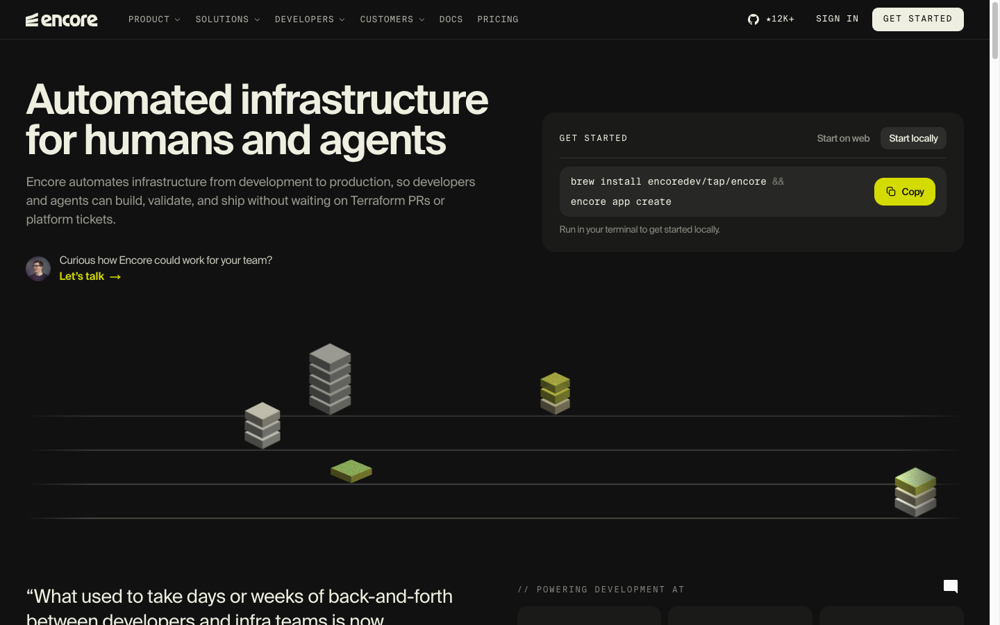
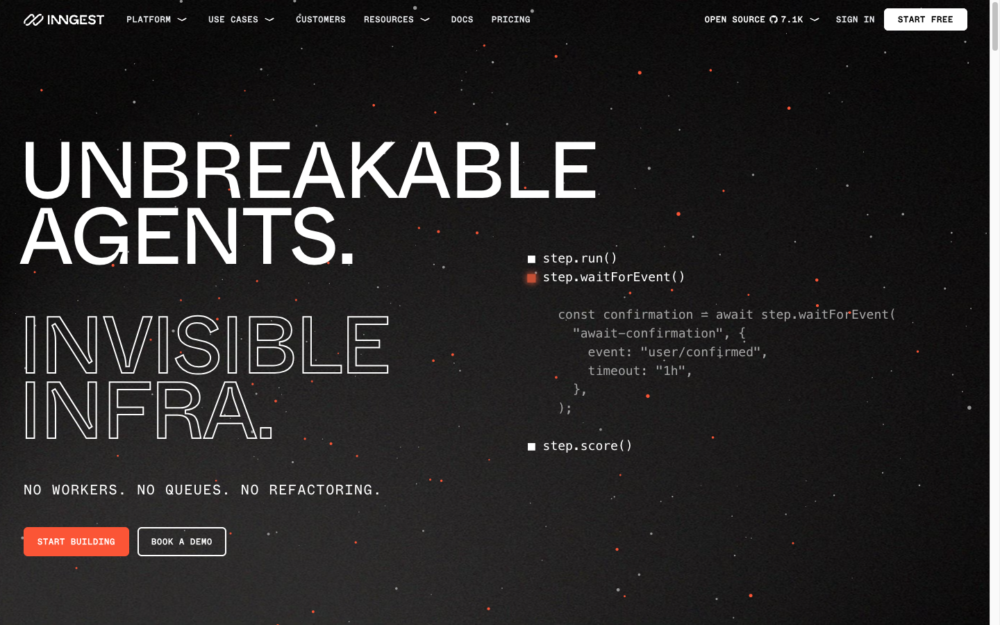
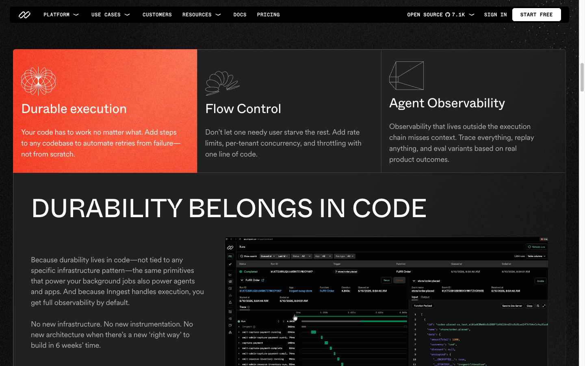
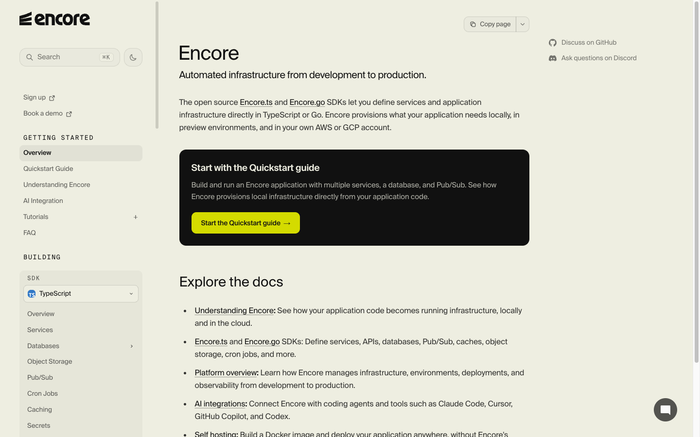
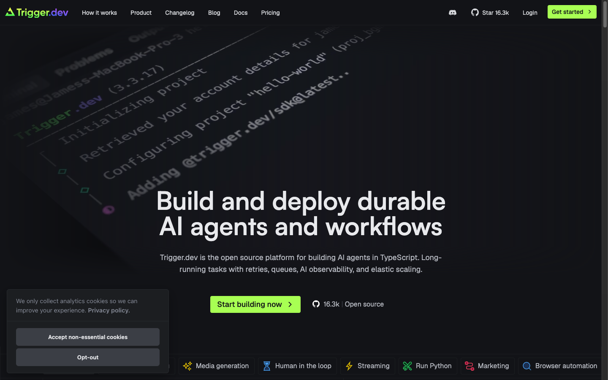
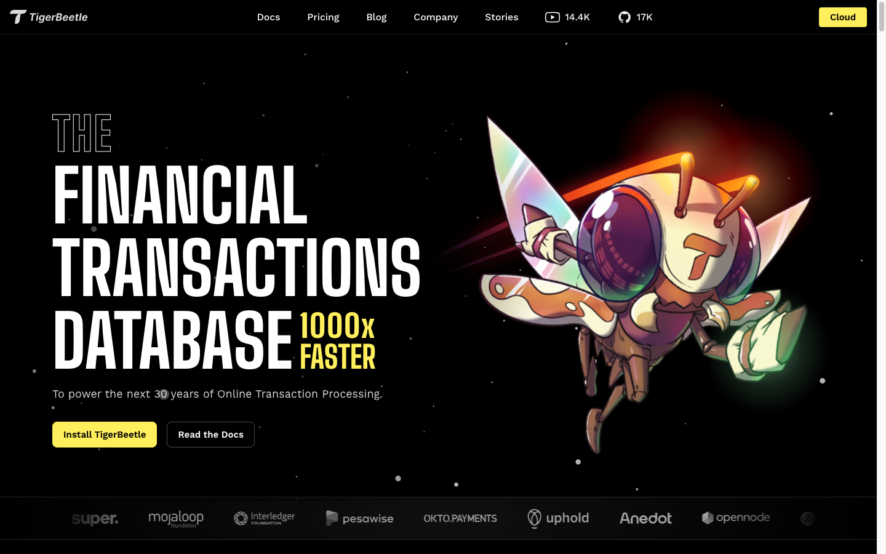
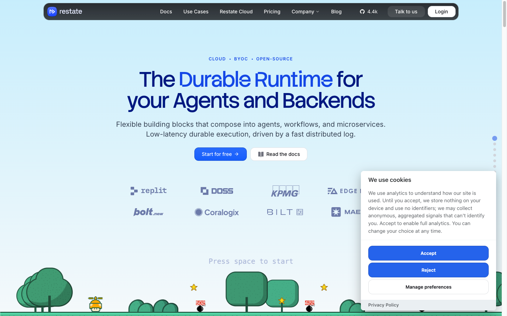
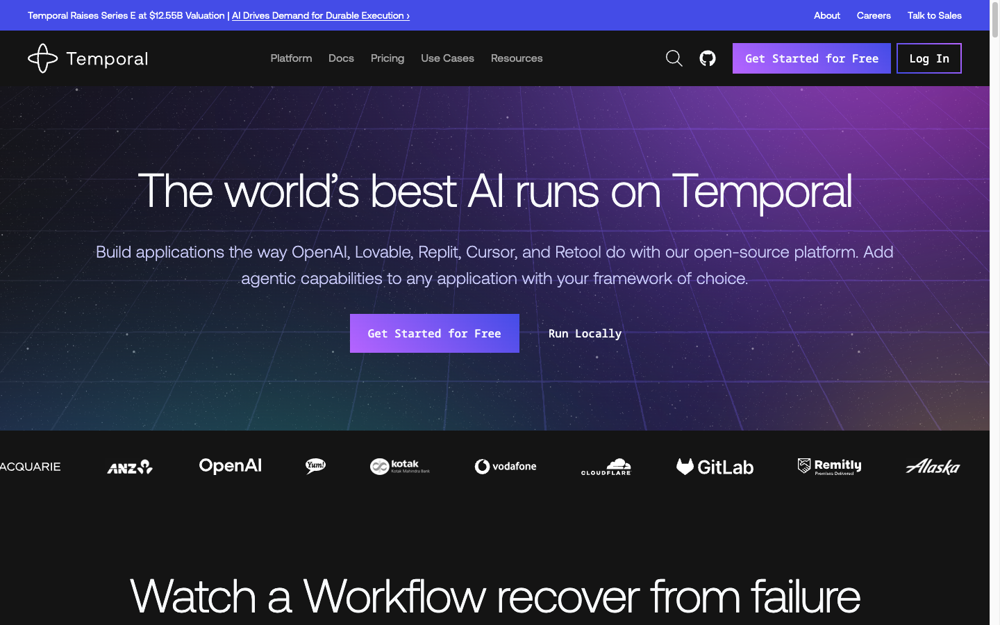

# Design-language candidates

**Status:** named inputs for DESIGN.md and the phase 6a spikes. **No language is selected.**

**Test rule:** identical real content, identical section order, identical logo, identical
diagram data in every spike. Change the design language, not the product. Each spike is one
self-contained HTML file in `spikes/`, generated in an isolated context, screenshotted at
1440 / 768 / 390 into a contact sheet.

**Spike content (fixed for all candidates):** the hero, the signature scene in its settled
"ON" state, and the integrations row. Three sections is enough to judge a world and not
enough to hide behind volume.

**The palette is already decided** (DECISIONS.md D16) and every candidate uses it
unchanged. `spikes/palette-locked.html` is the reference implementation of the tokens in
both themes; start each spike from its token block.

---

## Reference shortlist

Captures in `docs/refs/`. Reviewed at 1440 on 2026-09-17.

### 1. encore.dev - the closest structural match

**Take.** The hero split: claim and support line left, a real bordered panel on the right
carrying a copyable install command, with a small tab switcher and a Copy button. Both
halves are load-bearing; neither is decoration. Monospace uppercase eyebrows at ~11px with
generous tracking. `// POWERING DEVELOPMENT AT` - a section label written as a code comment.
Hairline rules extended across the full width as a spatial grid that objects sit *on*, not
inside. Asymmetric, left-aligned, no centring anywhere.

**Reject.** The isometric 3D blocks are rendered objects that mean nothing specific - they
read as "infrastructure" in the abstract. Our equivalents must encode real state. The
yellow accent is used decoratively in places. The customer-quote-plus-logo-wall section
directly below the fold.

**Note.** Encore's marketing site is dark and its docs are light. We are not inverting:
one theme system across both surfaces.

### 2. inngest.com - the strongest devices

**Take.** Enormous uppercase display type set to break the measure and run toward the
edge - `DURABILITY BELONGS IN CODE` at ~56px across two thirds of the viewport. A
hairline-divided row of three panels with **exactly one** filled in the accent colour: a
cheap, distinctive, entirely non-decorative move. Thin-stroke wireframe icons, geometric
and unfilled - a drawing language, not an icon set. The code sample presented as a
*step list* with state squares rather than as a window with a fake title bar. Monospace
uppercase navigation at 12px / 600 / 0.8px tracking. Putting a genuine trace timeline on
the marketing page and trusting the reader.

**Reject.** The starfield particle texture, which is atmosphere with no content. The
outlined-second-line headline treatment, which is a signature we would be borrowing
wholesale. Measured tokens: body `#0c0a09` (a *warm* near-black), accent coral-red, display
Circular, UI WhyteMono, 1440px cap.

> **Retired 2026-09-17.** This was the site's largest differentiation risk while the
> palette was inherited: warm near-black plus an orange-red accent plus mono uppercase
> chrome is Inngest's exact signature, and the old brand accent `#eb6c36` sat right next
> to theirs. The palette is now cyan-teal on a cool near-black (DECISIONS.md D16), so the
> risk is gone and the side-by-side adjacency check is dropped. What remains worth taking
> from Inngest is the **devices** above, not the colour.

### 3. encore.dev/docs - the docs model the owner named

**Take.** Monospace uppercase sidebar group labels (`GETTING STARTED`, `BUILDING`) - the
cheapest way to make a sidebar read as an instrument. Exactly one prominent card at the top
of the docs landing page, containing the single next action. Three-column layout with a
right-hand utility rail (GitHub, chat) so those links never invade the prose. Body copy at
20px with `-0.5px` tracking, `#111` on `#eeeee1`, measure ~65ch - large, calm, confident.
A "Copy page" control for feeding a page to an LLM.

**Reject.** The floating chat bubble. The language switcher inside a sidebar group, which
reads as a nested product. Typeface is Suisse Intl (licensed).

### 4. trigger.dev - one device, one lesson

**Take.** Treating a real terminal as a composed object placed in space, at an angle,
behind the type.

**Reject.** Almost everything else, as a lesson. Everything is centred, so nothing has
hierarchy. The terminal is blurred to near-illegibility, which makes real output into
wallpaper - the exact failure the owner named ("I don't just want to put code on the
page"). A horizontally scrolling row of emoji-labelled use-case chips. Lime accent.

### 5. tigerbeetle.com - confidence calibration

**Take.** The nerve of very large condensed uppercase on pure black, left-aligned, with a
single short support line and two plain buttons: `Install TigerBeetle` / `Read the Docs`.
That button pair is close to our own primary/secondary shape.

**Reject.** The mascot. `1000x FASTER` - we have no benchmarks and will not imply any. The
logo wall.

### 6. restate.dev - primary anti-reference

**Take.** Nothing.

**Reject.** Everything, and note that it is the *domain-adjacent* competitor, which makes it
the most instructive failure: centred hero, pale blue gradient, kicker as a bullet-separated
tag row, logo wall above the fold, and a scrolling platform-game illustration. This is
precisely the "SaaS startup" register the brief rules out. Whenever a spike starts to feel
comfortable, check it against this page.

### 7. temporal.io - secondary anti-reference

**Take.** One thing: a section heading whose entire job is to introduce a mechanism you are
about to watch - "Watch a Workflow recover from failure". That is the correct framing for
our signature scene.

**Reject.** Purple enterprise gradient with a faint perspective grid. A funding announcement
banner pinned above the navigation. Logo wall immediately below the fold. Centred hero.

---

## Shared constraints

Every candidate must honour all of these. A spike that breaks one is disqualified rather
than debated.

1. **Dark-first.** Cool near-black ground. Light mode exists and must not be an
   afterthought, but dark is what gets designed and reviewed.
2. **The locked tokens only** (DESIGN.md, direction A. Instrument). No candidate introduces
   a colour, and no candidate adds a second accent. The palette is settled; these spikes
   test *language*, not colour.
3. **One accent, one meaning.** `--signal` marks the idempotent path - the replayed result,
   the guarded boundary, the stored record - and nothing else. No accent on hover states,
   headings, borders or emphasis.
4. **The one peak** is the duplicate-request scene. Everything else stays quiet.
5. **Every diagram must be legible as a single still frame,** with no motion and no
   interaction. Reduced motion, the social preview image and a printed page all consume the
   still.
6. **No decorative marks.** If a line, box or shape does not encode real library behaviour,
   it comes off the page.
7. **Left-aligned, asymmetric.** Nothing centred above the fold.
8. **The hero carries a copyable Maven coordinate.** Real text, real Copy button, works
   without JavaScript as selectable text.
9. **Adjectives:** instrumented, exact, unembarrassed.
10. **The refuse list in DESIGN.md**, in full, including "the accent is never a status hue"
    and "no second accent, ever".
11. Reviewed at 1440 / 768 / 390.

---

## Candidates

| Candidate | One-line direction | How the library's story enters the system | Reference anchors | Profile implied |
|---|---|---|---|---|
| **A. Trace Viewer** | The site is an observability tool showing its own subject. | Time is the horizontal axis everywhere. The record's life is a span; the lease is a bar that extends; a duplicate is a second span that terminates early against a stored result. Sections are lanes on a shared timeline. Durations (`PT30S`, `PT10S`) are rendered at scale, not as labels. | inngest trace timeline; encore hairline grid | Kinetic |
| **B. Figure Plate** | The site is a technical paper: numbered figures, captions, tables, almost no colour. | Each homepage section is `Fig. 1`–`Fig. 6` with a real caption in the voice of the README. The existing diagram pair drops in untouched as two of the plates. Dense tables are a feature, not a compromise - the support matrix and the status-code table become design objects. | encore/docs measure and calm; tigerbeetle rigour minus the mascot | Kinetic, near the low-motion end |
| **C. Terminal Lab** | Near-black, monospace-dominant, every object inside a bordered cell on a visible grid. | State names are set in mono and never translated into friendly language: `IN_PROGRESS`, `COMPLETE`, `Outcome.Replayed`. Section labels are `//` comments. The grid is the architecture: four layer cells, three store cells. | inngest chrome; encore `//` labels | Kinetic |
| **D. Wireframe Objects** | Thin-stroke axonometric line drawings of the record, the lease and the store as physical objects sitting on hairlines. | The engine's parts become drawn objects with real relationships: a record as a box that fills, a lease as a ring that decays, a store as a stack the box lands in. Drawn in SVG, never rendered, never shaded. | inngest wireframe icons; encore isometric blocks, drawn rather than rendered | Kinetic |
| **E. State Machine** | The page *is* the record's state machine; sections are states and scrolling is the transition. | The homepage follows `absent → IN_PROGRESS → COMPLETE → purged`, with the release edge as a visible branch. Navigation shows which state you are in. The existing lifecycle diagram becomes the site's own structure. | none directly - the library's own diagram | Kinetic |

### Candidate notes and known risks

- **A. Trace Viewer** is the most on-brief ("instrumented") and the most likely to make the
  execution model self-evident. Risk: horizontal timelines collapse badly at 390px, and the
  whole language could fail on mobile. The spike must be judged at 390 first.
- **B. Figure Plate** is the safest, ages best, and is the only candidate where the existing
  diagrams need zero rework. Risk: quiet to the point of being unmemorable, and it is the
  candidate most likely to look like documentation rather than a home page.
- **C. Terminal Lab** is the strongest fit to the owner's sketch and the fastest to build.
  Its former Inngest-adjacency risk is largely retired with the palette (DECISIONS.md D16);
  what remains is the mono-uppercase chrome, which is a real shared device. If this
  candidate wins, the display face is where it must pull away.
- **D. Wireframe Objects** has the highest ceiling - a genuinely proprietary drawing
  language nobody else in the category has - and the highest cost, since every object must
  be drawn by hand. Risk: illustration drifting into decoration, which shared constraint 6
  forbids.
- **E. State Machine** is the most conceptually tight and the most likely to become a
  gimmick that fights the reader's own reason for visiting. Include it because it is the
  only candidate that could produce something unrepeatable, and expect to learn one device
  from it rather than adopt it whole.

### Spike order

Run all five. If budget forces a cut, drop **E** first and **B** last - B is the fallback
that certainly works.
